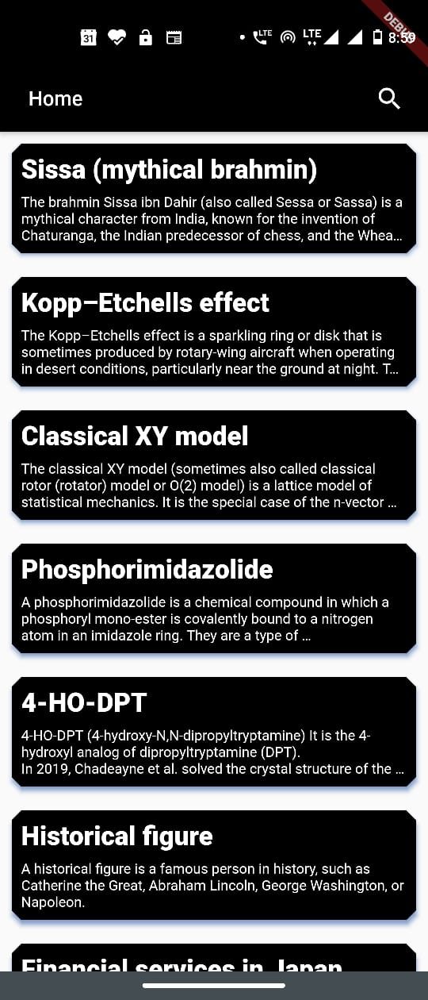

# WikipediaApp
I am created a Simple Wikipedia App using Flutter. The goal is to give Wikipedia Medium like UI.

## Here are some simple Screenshots

### 1) Splash Screen

### 2) Home Screen

### 3) Search Screen

### 4) Search Screen

### 5) Search Result

### 6) Page Result

